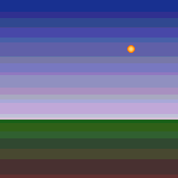

# sml-qoi

A complete **QOI** ([Quite OK Image](https://qoiformat.org)) codec in pure
Standard ML — lossless `encode` / `decode` over the
[`sml-image`](https://github.com/sjqtentacles/sml-image) RGBA8 representation. No
FFI, no external dependencies, and **deterministic**: byte-identical output
under both [MLton](http://mlton.org/) and [Poly/ML](https://www.polyml.org/).



*Generated by [`examples/demo.sml`](examples/demo.sml) (`make example`): a banded
sunset built from integer arithmetic, encoded to QOI, decoded straight back, and
written out as the PNG above. The 256×256 image is **262,144** raw RGBA bytes and
**1,425** QOI bytes — **183× smaller** (0.5% of raw) — and round-trips losslessly.*

## Status

- **31 assertions, green on MLton and Poly/ML** (`N passed, 0 failed`, deterministic).
- The encoder is **byte-exact against the official `phoboslab/qoi` reference
  encoder**: the committed [`test/fixtures/reference.qoi`](test/fixtures/reference.qoi)
  is produced by the canonical `qoi_encode` (see [`tools/genqoi.c`](tools/genqoi.c)),
  and the suite asserts both `decode(reference.qoi) = source` and
  `encode(source) = reference.qoi` byte-for-byte.
- Spec-compliant: this library's output also decodes cleanly in the official
  reference decoder, not just its own round trip.
- Vendors `sml-image` (and its `sml-inflate` + `sml-color`) under `lib/`
  (Layout B), so the repo builds standalone.

## Install

With [`smlpkg`](https://github.com/diku-dk/smlpkg):

```
smlpkg add github.com/sjqtentacles/sml-qoi
smlpkg sync
```

Then reference the library's MLB (it pulls in the vendored `sml-image`):

```
local
  $(SML_LIB)/basis/basis.mlb
  lib/github.com/sjqtentacles/sml-qoi/... (via smlpkg)
in
  ...
end
```

This brings `structure Qoi` (and the vendored `Image`) into scope.

## Quick start

```sml
(* a 2x2 RGBA image: red, green, blue, white *)
val img : Image.image =
  { width = 2, height = 2
  , data = Word8Vector.fromList
      [ 0wxFF,0wx00,0wx00,0wxFF,  0wx00,0wxFF,0wx00,0wxFF
      , 0wx00,0wx00,0wxFF,0wxFF,  0wxFF,0wxFF,0wxFF,0wxFF ] }

val bytes : Word8Vector.vector = Qoi.encode img   (* -> .qoi byte stream *)
val back  : Image.image        = Qoi.decode bytes (* lossless round trip *)

val os = BinIO.openOut "out.qoi"
val () = (BinIO.output (os, bytes); BinIO.closeOut os)
```

## API

```sml
exception Qoi of string
val encode : Image.image -> Word8Vector.vector
val decode : Word8Vector.vector -> Image.image
```

- `image = { width : int, height : int, data : Word8Vector.vector }` — RGBA8,
  row-major, top-left origin; `data` is `4 * width * height` bytes.
- `encode` always writes `channels = 4` (RGBA) and `colorspace = 0` (sRGB), since
  that is the `sml-image` representation.
- `decode` accepts both 3-channel (RGB, alpha forced to 255) and 4-channel
  streams. Malformed input — bad magic, bad header, truncated stream — raises
  `Qoi`.

## The format

A QOI byte stream is a 14-byte header, a sequence of chunks, and an 8-byte end
marker:

| Part | Bytes |
| --- | --- |
| Header | `"qoif"`, 4-byte big-endian width, 4-byte big-endian height, 1-byte channels (3/4), 1-byte colorspace (0/1) |
| End marker | seven `0x00` bytes then one `0x01` byte |

Each chunk is one of:

| Chunk | Tag | Meaning |
| --- | --- | --- |
| `QOI_OP_RGB`   | `0xFE` | full RGB; alpha carried over (3 following bytes) |
| `QOI_OP_RGBA`  | `0xFF` | full RGBA (4 following bytes) |
| `QOI_OP_INDEX` | `00xxxxxx` | reference into the 64-entry running pixel hash |
| `QOI_OP_DIFF`  | `01xxxxxx` | per-channel diff vs. previous, 2 bits each, bias 2 (−2..1) |
| `QOI_OP_LUMA`  | `10xxxxxx` | green diff (bias 32) + red/blue relative to green (bias 8) |
| `QOI_OP_RUN`   | `11xxxxxx` | run length of the previous pixel, bias −1 (1..62) |

The encoder maintains the canonical running state — the previous pixel
(initialised to `{0,0,0,255}`) and a 64-entry array indexed by the hash
`(r*3 + g*5 + b*7 + a*11) mod 64` (initialised to `{0,0,0,0}`) — and emits chunks
in the reference priority order **RUN → INDEX → DIFF → LUMA → RGB/RGBA**, so its
output is identical to the reference encoder for the same pixels. Channel diffs
use signed 8-bit wraparound, exactly as the spec requires.

### Determinism

Everything is integer arithmetic over the Basis library — no FFI, threads,
floating point, wall clock, or randomness — so a given image encodes to the exact
same bytes on every run and on both compilers. The committed demo asset is
reproduced bit-for-bit by `make example` under MLton or Poly/ML.

## Build & test

```
make test        # MLton
make test-poly   # Poly/ML
make all-tests   # both
make example     # round-trip the demo image -> assets/demo.qoi + assets/demo.png
make clean
```

### Regenerating the reference fixture

The committed fixture is third-party (the official QOI encoder), not
self-generated:

```
cd tools
curl -fsSL https://raw.githubusercontent.com/phoboslab/qoi/master/qoi.h -o qoi.h
cc -O2 -o genqoi genqoi.c && ./genqoi   # writes reference.qoi
```

## License

MIT — see [LICENSE](LICENSE). The QOI format is by Dominic Szablewski; the
reference `qoi.h` used only in `tools/` to regenerate the test fixture is MIT /
public domain.
